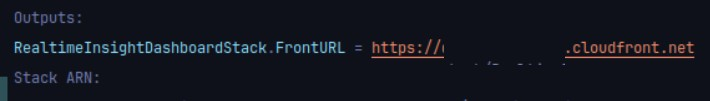

# Real-time Sentiment Analytics and Insights Dashboard

## Directory structure

```bash
.
|-- backend
|-- cdk
|-- front
|-- feedbackIngestionSimulator
```

* **backend**: Contains the Lambda functions for the backend.
* **cdk**: Contains the AWS CDK code for deploying the infrastructure.
* **front**: Contains the React frontend code.
* **feedbackIngestionSimulator**: Contains the script for simulating feedback ingestion.

## Requirements

### Environment

* Node.js > 22
* Docker
* AWS CLI

### OpenAI API Key

This project uses OpenAI's API.
To use the OpenAI API, you need to set up an account and obtain an API key.

### Disocrod Webhook URL

This project uses Discord's webhook to send alerts.([see](https://support.discord.com/hc/en-us/articles/228383668-Intro-to-Webhooks))

### AWS

* AWS account
* AWS CLI Access Key and Secret Key

To run AWS CDK, it is required to set up the AWS CLI and credentials.
https://docs.aws.amazon.com/cdk/v2/guide/prerequisites.html#prerequisites-cli

## Deploy

> [!NOTE]
> This repository has multiple projects.
> Run `npm ci` in each project to install the dependencies when you need.

The deployment process is done under the `/cdk` directory.
If nothing is mentioned, the following operations are within that directory:

1 . Boostrap the CDK environment.

```bash
npm run cdk bootstrap
```

2 . Deploy the CDK stack.

By running the following command, the CDK stack will be deployed.

```bash
npm run cdk deploy "*"
```

The API Gateway URL and CloudFront URL will be printed in the console.
You must keep for the next step.:

- The API Gateway URL
-  Websocket URL



> [!TIP]
> To destroy the environment, run `npm run cdk destroy "*"`.

3. Set secret values to the Secret Manager.

The OpenAI API key and Discord webhook URL are set in the AWS Secret Manager in the AWS console.
Each name must be the following:

- `openaiAiKey`: The OpenAI API key.
- `discordUrl`: The Discord webhook URL.

Note that the Secret Manage is created when you run the cdk command.
The Secret Manager's name is `RealTimeInsightsSecret`.

4. Set up the frontend.

Set the environment variables in the `.env` file under the `/front` directory.
The environment variables are the above two URLs.
Then build the frontend using the following command:

```bash
npm run build
```

5. Upload the frontend to S3.

Upload the `dist` directory to the S3 bucket created by the CDK.

## Architecture overview

The user of this application is a customer experience team.
The application supports two use cases:

1. **Real-time sentiment analytics**: The dashboard provides real-time insights into customer sentiment, allowing the team to monitor feedback trends and identify potential issues.
2. **Error statements analytics**: The dashboard provides a specific state based on the filter.

### Frontend

The frontend is built using React.
That is deployed on S3 and delivered via CloudFront.


### Backend


#### Feedback Ingestion Simulator

The feedback ingestion simulator is a script that generates new feedback entries every few seconds.
The script is run in a PC.

#### Sentiment Analysis Pipeline

The sentiment analysis pipeline is a serverless architecture that uses AWS Lambda and SQS to process feedback in real-time.
The feedbacks from users are sent to an SQS queue, then the SQS calls the StatementFunction.
The function calls the OpenAI API and analyze the sentiment of the feedback.
Then the results are stored in Amazon Timestream.

> [!NOTE]
> The reason for using SQS is to enhance the usability and scalability of the system.
> There is no guarantee of the response time from the AI; it could be longer than the connection limit of the API Gateway to a client (30 sec).
> In addition to that, the SQS can retry the failed requests.

#### Suggestions Engine

The suggestions engine extracts the most recent 50–100 feedback entries and generates actionable suggestions based on sentiment trends using ChatGPT.

#### Email Alerts/Notifications

After the feedback is analyzed, the latest timestream data is sent to the AlertAnalyticsQueue.
Then, the AlertAnalysisFunction is called.
The function retrieves 5 minutes of window data from the latest data from Timestream and checks if there are more than 5 negative sentiments.
If the condition is met, the function sends an alert to the user via Discord webhook and frontend via web socket.

> [!NOTE]
> The reason for avoiding email (SMS) is the deadline.
> To send an email, the users need to ask the AWS. It can take several days, depending on the situation. 
> To avoid this, the alert is sent via Discord webhook and web socket.

#### API Layer

Exposes endpoints via API Gateway for fetching feedback, and returning the data.
The API is built using AWS Lambda functions.
This layer handles the feedbacks and returns the data to the frontend.
The feedback is sent to the SQS queue, which is then processed by the Lambda function. (see the Sentiment Analysis Pipeline section above)

This application require the pushing of the data to the frontend.
To do this, webs socket API Gateway is also used.
Once connection is established, the connection ID is stored in DynamoDB.
Using this connection ID, the backend can push data to the frontend.
When the connection is closed, the connection ID is removed from DynamoDB.

